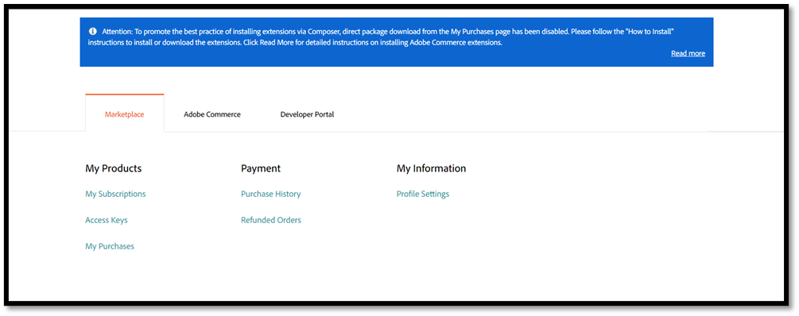
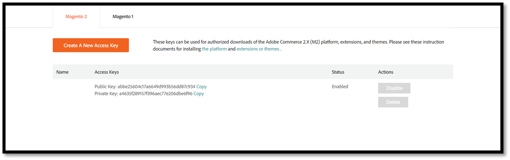
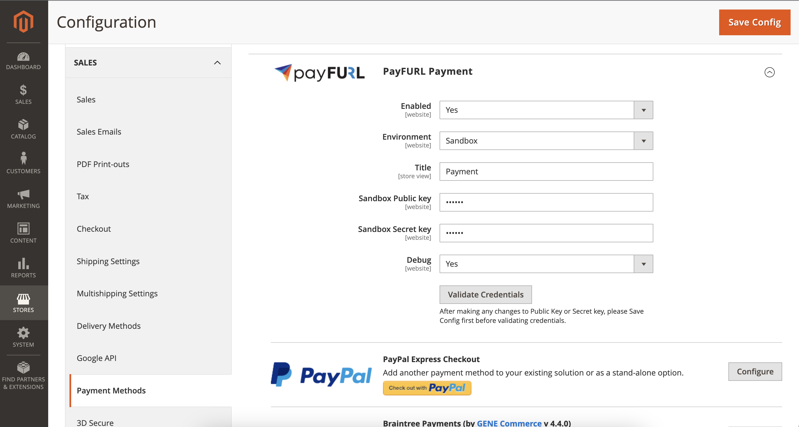

## Prerequisite to Install Magento xpanse Extension

To install this Magento extension, it is recommended to switch to the development environment – don’t install Magento extensions directly in the production environment.
**Back up your Magento store** before installing the Magento extension:

Make sure to take the latest backup of your Magento production store.

Run the following command:
```commandline
php bin/magento setup:backup --code --media –db
```

Or you can also take a manual backup by copying your Magento directory.

**Check the PHP version**: Some extensions require a higher or lower PHP version.
Check your current PHP version by running the command:

```commandline
php -v
```

**Enable Maintenance Mode**: Enable maintenance mode before installing the extension to avoid any user issues.
To enable maintenance mode run below command

```commandline
php bin/magento maintenance:enable
```


## Install Magento xpanse Extension Through Composer

This requires complete shell SSH access to your server. If you don’t have this, please ask the service provider for it, or you can run it through the terminal on your local machine.

### Step 1: Connect to SSH

After getting the SSH credentials, login to the terminal or command line through SSH. You can also use Putty to connect to SSH.

### Step: 2 Run the composer command

Check the Composer version. Some extensions have dependencies with Composer versions. Run this command to check:

```commandline
composer -v
```

or 

```commandline
composer –version
```

If your Magento version is below 2.4.2, the Composer version should be v1.

For Magento 2.4.2 and above, Composer v1 and v2 are allowed. 

In this guide, we are working with Magento 2.4.6. Install the required Composer version following the guide on getcomposer.org.

Start the Composer installation. 

```commandline
composer require xpanse/module-payment
```

The extension requires a Marketplace account.
Sign in to the [Marketplace or create an account](https://marketplace.magento.com/) 
if you don’t have one. Go to the My Profile -> Marketplace tab and click Access keys:




If you don’t have any keys, generate them. Make sure the status of the keys is enabled.

**Public key** is the username.

**Private key** is the password.

Copy the public key and paste it to the username. You will be asked to save the credentials for later use. Please type “Y” if you want to save the settings.

Let the extension install completely. Run “composer update” after installing the Magento extension.

### Step: 3 Run all commands to update the changes

```commandline
php bin/magento setup:upgrade
php bin/magento setup:di:compile
php bin/magento setup:static-content:deploy -f
php bin/magento cache:flush
```

Check to see if your admin and front store are working properly.


## How to configure xpanse extension

Login to the admin interface and then go to the Stores -> Configuration, then Sales -> Payment Methods -> Payment



You need to select the environment and fill in **Public Key** and **Secret Key** fields.
Make sure to use the right key for the environment (use the test key in sandbox and the live key in production)
